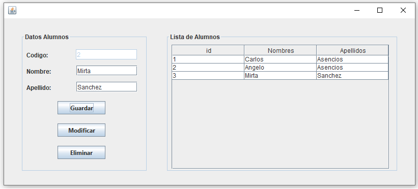
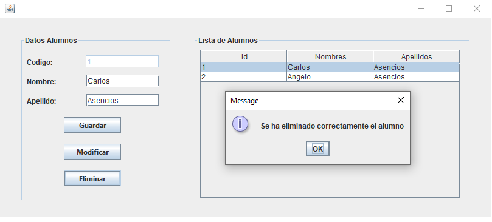
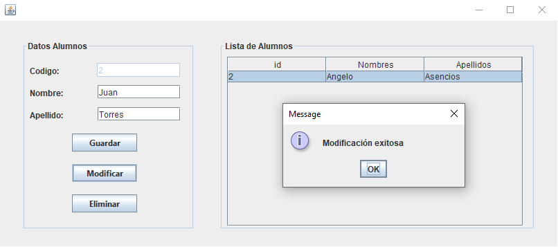
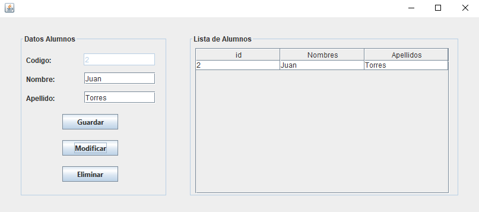

# CRUD utilizando Java y MySQL

CRUD en Java en el IDE Apache Netbeans y MySQL
Capturas del Sistema:

### Autor
- Alexandro Asencios

### Contacto
- [aa.asencios@gmail.com](mailto:aa.asenciosg@gmail.com)
- [angelo_asenciosg@outlook.com](mailto:angelo_asenciosg@outlook.com)
